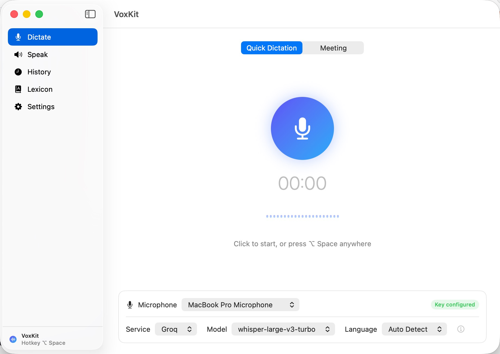
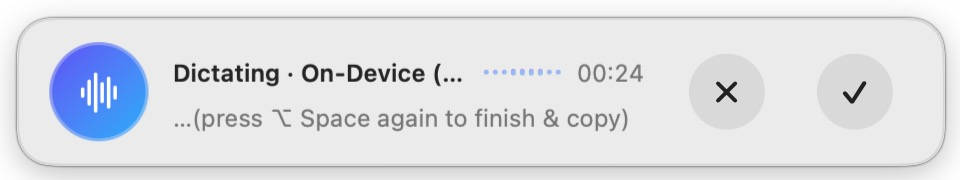

# VoxKit: a small detour into AI-built voice dictation software

*This has nothing to do with my research — it's a for-fun side project, and an
experiment in what the newest AI models can actually do.*

I use GPT-style assistants a lot in daily life: as a tour guide when I
travel, and for looking up words and hearing how they're pronounced.
Along the way I noticed two things. First, their speech recognition is dramatically
better than anything else I'd used, better than my input method, better than Apple's
built-in dictation. Second, both ends of the voice pipeline (speech-to-text and
text-to-speech) are locked inside the chat apps. If I just wanted to *dictate into any
text field* or *hear any text read aloud*, I had to either go through the whole ChatGPT
front door or write separate code just for doing these tasks. Heavy, for such a light wish.

So I'd been carrying this idea around: pull those two capabilities out into a
lightweight interface.

## The experiment

The trigger was Anthropic shipping its newest Claude model (Fable 5) a couple of
days ago. The model was handed exactly that idea — "wrap the speech APIs into
something lightweight." What came back
instead was a complete native macOS app.

That was encouraging enough to keep going, and the feature list grew over a day
of conversation: meeting transcription with speaker diarization, a review panel for
quick fixes, a lexicon that learns the user's vocabulary, text-to-speech with
selectable voices, five interface languages. The human side of the exchange mostly
described what was annoying; the model wrote essentially all of the code.

None of this is technically novel. Apps like this exist, and the speech models are all someone else's work. But there is a pleasure
in a tool shaped exactly to my own habits. As an experiment, it definitely succeeded.

## What it does

- **Hotkey dictation** — press `⌥ Space` in any app, speak, and the transcript lands
  on the clipboard; recognition runs on Apple's free on-device engine or on cloud
  models (OpenAI, …), selectable per task
- **Meeting transcription** — long recordings, background processing, speaker labels
- **Text-to-speech** — type text, pick a voice, get audio
- **A lexicon that learns** — corrections made in transcripts become hotwords that
  steer future recognition
- **Local and light** — ~5 MB native SwiftUI, keys in the macOS Keychain, all data
  on disk

<figure>
  
  <figcaption>The main window: quick dictation, with the speech service, model, and language selectable per task.</figcaption>
</figure>

<figure>
  
  <figcaption>The floating bar shown while dictating in any app — pressing ⌥&nbsp;Space again finishes and copies the transcript.</figcaption>
</figure>
 

Code and downloads: [github.com/ZikaiXiong/VoxKit](https://github.com/ZikaiXiong/VoxKit)
