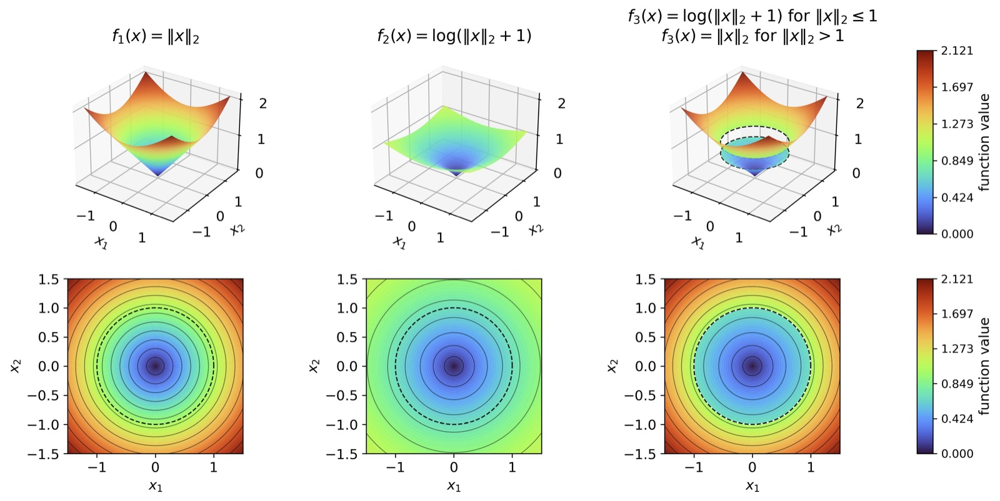
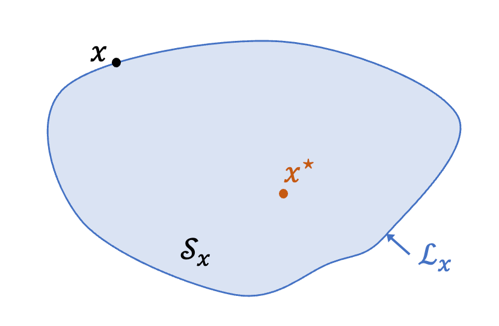
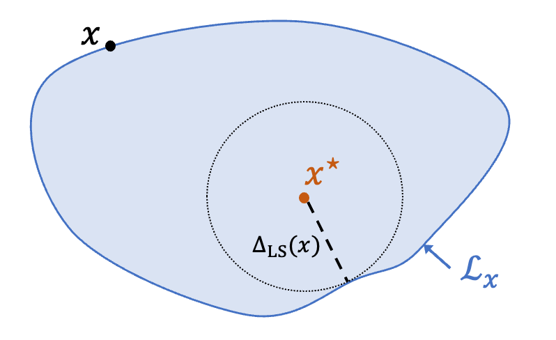
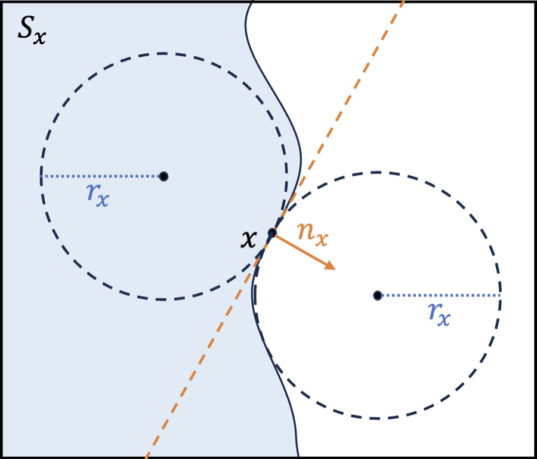
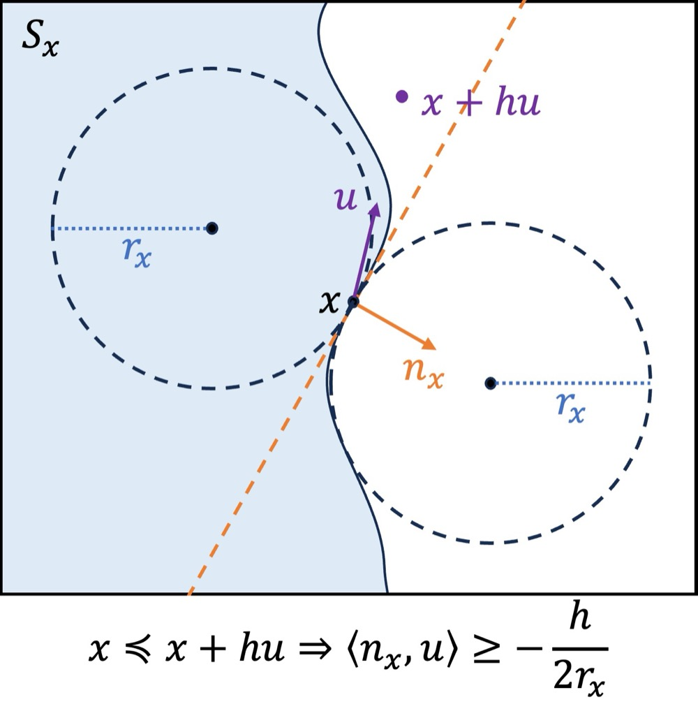
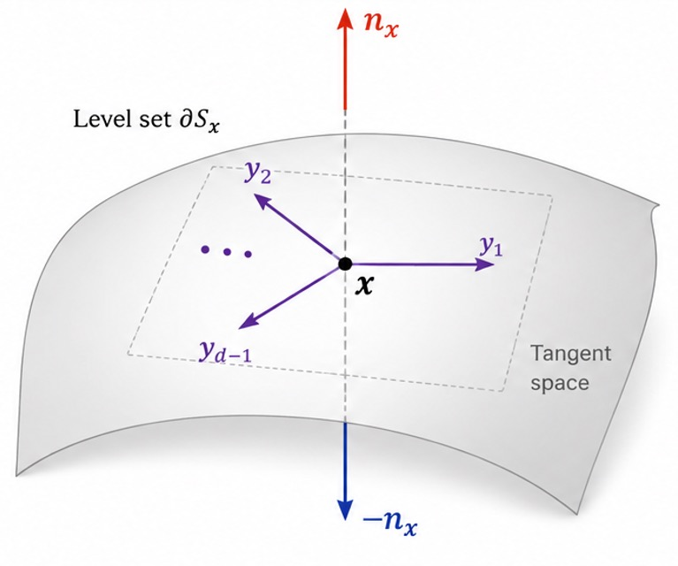
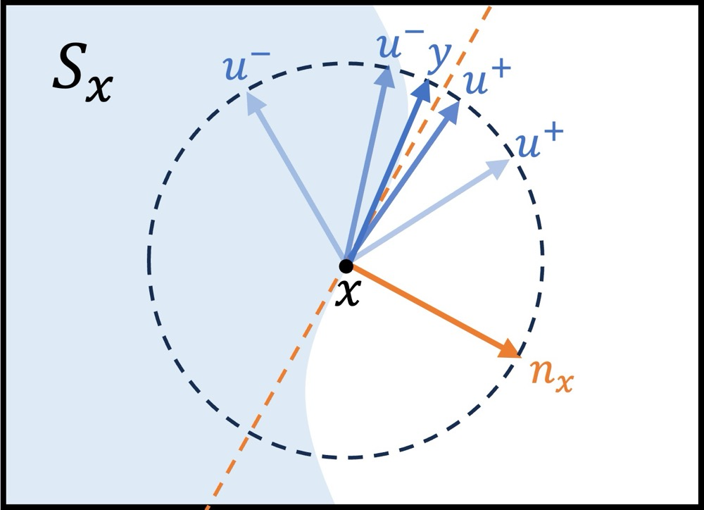

# Optimization Without an Objective Function

**What if an optimization problem gives you comparisons between points — but no objective values, no gradients, and not even a well-defined objective function? Function-free optimization builds the formulation, the geometry, and the algorithms directly from the preference relation itself.**

*This post is based on a talk I gave on joint work with Katya Scheinberg (Georgia Tech). The paper, "Function-Free Optimization via Comparison Oracles," is available on arXiv.*
<!-- TODO: insert arXiv link -->

---

## The motivating question

Suppose you want to optimize a system, and the only feedback you can get is of the form: *"point A is better than point B."* Not "A scores 3.7 and B scores 2.9" — just which one is preferred. How should you even *formulate* the optimization problem, let alone solve it?

This is not an exotic situation. In many modern applications, the native signal is ordinal:

- **Search and ranking systems** observe clicks and relative preferences, not utility values.
- **A/B testing and recommendation** query a latent objective only through comparisons between alternatives.
- **Human-in-the-loop personalization and clinical tuning** ask "which one feels better?" — because asking a patient for a numerical score is far less well-defined than asking for a comparison.
- **Preference-based RL and RLHF** collect human comparisons between trajectories or rankings of model outputs, not reward values.

In all of these settings, the observable information is *which option is better*, not *how much better*. The natural oracle is a **comparison oracle**: it takes two points and reports which one is preferred (or that they are tied).

Comparisons are not new in optimization. Classical derivative-free methods — direct search, Nelder–Mead — make their decisions by comparing function values at trial points. More recent work models comparisons explicitly, under names like comparison-based optimization, dueling optimization, sub-zeroth-order oracles, and ranking oracles, with applications in preference alignment. But in essentially all of this literature, the comparison is treated as a *weaker interface to a hidden scalar objective*: the modeling assumes some latent function $f$ exists, the assumptions are about $f$ (smooth, convex, strongly convex...), and the guarantees are stated in terms of $f$ (function-value gap, gradient norm, regret).

That creates a gap between applications and methods. The application hands you an order between points. The theory answers in a currency — function values, gradients — that the application never defined.

## Why a hidden objective function is the wrong primitive

You might object: surely there is *some* function behind the preferences, so why not just analyze that? Two problems.

First, an application-given objective function may simply not exist. A human comparing two treatment settings is not evaluating a scalar field in their head.

Second, and more fundamentally: **even when representative functions exist, comparisons cannot identify which one you are looking at.** Consider three functions on $\mathbb{R}^2$:

$$f_1(x) = \|x\|_2, \qquad f_2(x) = \log(\|x\|_2 + 1), \qquad f_3(x) = \begin{cases} \log(\|x\|_2+1) & \|x\|_2 \le 1 \\ \|x\|_2 & \|x\|_2 > 1.\end{cases}$$

One is convex and nonsmooth at the minimizer, one is nonconvex, and one is discontinuous. They are dramatically different as functions — different values, different gradients, different smoothness and convexity. But their level sets all have the same shape: circles centered at the origin. So for *every* pair of points, all three functions order the pair identically: $x$ is preferred to $y$ exactly when $\|x\|_2 \le \|y\|_2$.

*Figure 1. Three functions that are convex/nonconvex, smooth/nonsmooth, continuous/discontinuous (top row), yet have identical level-set shapes (bottom row) and therefore induce exactly the same pairwise comparisons. Notice that any comparison-based algorithm run on these three problems sees identical feedback and produces identical iterates.*

Any algorithm that uses only comparisons will receive the same oracle replies on all three problems and generate the same trajectory of iterates. Comparisons identify the *order* between points — equivalently, the *sublevel-set geometry* — and nothing more. They cannot see objective values, gradient magnitudes, convexity, or smoothness, because none of these survive a strictly increasing reparameterization of the function.

This has a sharp consequence: if your algorithm only uses comparisons, then a guarantee stated in terms of function-value gap or gradient norm is not intrinsic to the information your algorithm actually receives. Choosing one representative function injects artificial structure that the comparison oracle cannot distinguish.

So the question we set out to answer is:

> **How should we formulate and analyze optimization using only a preference relation, without choosing any application-given objective function?**

We call the resulting framework **function-free optimization (FFO)** — free of an application-given objective function.

## The function-free formulation

The primitive object is a **preference relation** $\preccurlyeq$ on $\mathbb{R}^d$ (or any $d$-dimensional Euclidean space): $x \preccurlyeq y$ means "$x$ is preferred to $y$" (no worse than $y$). It comes with a strict preference $x \prec y$ and an indifference relation $x \sim y$. We assume the relation is **complete** (every pair is comparable) and **transitive** (no preference cycles). The comparison oracle, given $(x, y)$, reports which of $x \prec y$, $y \prec x$, or $x \sim y$ holds.

The optimization problem is then exactly what you would hope:

$$\text{find } x^\star \in \mathcal{C} \quad \text{such that} \quad x^\star \preccurlyeq y \ \text{ for all } y \in \mathcal{C},$$

where $\mathcal{C}$ is a convex feasible set with efficient projections (the standard setup from convex optimization). We write $\mathcal{X}^\star$ for the set of such most-preferred points.

One important caveat about scope: throughout, the comparison oracle is **noiseless**. Comparisons that err with a fixed probability can be reduced to this setting by repetition and majority vote. But noise models in which the error probability depends on the *function-value difference* between the two points are inherently tied to a particular objective function — they are, by construction, not function-free, and are outside this framework.

## Geometry replaces objective values

Without function values, what structure do we have? Level sets. For any point $x$, define the **(preference) sublevel set** and **level set**

$$\mathcal{S}_x := \{y : y \preccurlyeq x\}, \qquad \mathcal{L}_x := \{y : y \sim x\}.$$

These are defined purely from comparisons. And they are not a lossy summary: the preference relation can be read back from the inclusion structure of the sublevel sets — $y \preccurlyeq x$ if and only if $\mathcal{S}_y \subseteq \mathcal{S}_x$. So "the preference relation" and "the family of sublevel sets" are essentially the same object, and assumptions on preferences can be stated as geometric assumptions on sublevel sets.

*Figure 2. The sublevel set $\mathcal{S}_x$ (shaded) collects everything preferred to $x$; the level set $\mathcal{L}_x$ is its boundary curve, the points indifferent to $x$. Notice that the optimal solution $x^\star$ lies inside every sublevel set — the optimal set is the intersection of all of them.*

We work with three assumptions, all imposed directly on the preference relation:

- **Plateau-free:** for non-optimal $x$, the level set $\mathcal{L}_x$ is exactly the boundary of $\mathcal{S}_x$. No thick regions of indifference.
- **Convexity:** each sublevel set $\mathcal{S}_x$ is convex. Intuitively: if you prefer $a$ to $x$ and also prefer $b$ to $x$, you prefer any blend of $a$ and $b$ to $x$. (This is invoked only for the global optimization guarantees.)
- **Regularity:** the sublevel-set boundary admits two-sided tangent balls — the function-free analogue of smoothness, made precise next.

### Measuring suboptimality without function values

In classical optimization, solution quality is measured by $f(x) - f^\star$. That is unavailable, and not even meaningful, here. The first candidate replacement is the Euclidean distance $\mathrm{dist}(x, \mathcal{X}^\star)$. But it has a defect: two points on the *same level set* are indistinguishable to the preference relation — any sensible suboptimality measure should assign them the same value — yet they can have very different distances to $\mathcal{X}^\star$.

The fix is to measure the distance from the *whole level set* to the optimal set. We call

$$\Delta_{\mathrm{LS}}(x) := \mathrm{dist}(\mathcal{X}^\star, \mathcal{L}_x)$$

the **level-set optimality gap** of $x$. By construction it is constant on level sets, it never exceeds $\mathrm{dist}(x, \mathcal{X}^\star)$, and if it is small, then some point indifferent to $x$ is close to the optimal set — from the preference relation's own point of view, $x$ is as good as a near-optimal point.

*Figure 3. The level-set optimality gap $\Delta_{\mathrm{LS}}(x)$ is the shortest distance from the level set $\mathcal{L}_x$ to the optimal set — equivalently, the radius of the largest ball around $x^\star$ that fits inside $\mathcal{S}_x$. Notice it is the same for every point on $\mathcal{L}_x$, unlike the pointwise distance to $x^\star$.*

### Normal directions and the regularity radius

In smooth optimization the gradient tells you how to improve. Comparisons cannot give you a gradient — its magnitude is not even identifiable — but they can give you something almost as useful: the **normal direction** $n_x$, the unit direction pointing fastest *out of* the sublevel set $\mathcal{S}_x$ at a boundary point $x$. Moving against $n_x$ moves *inward* — toward more-preferred territory. Since the optimal set sits inside every sublevel set, moving inward is making progress. (When a differentiable function happens to realize the preference, $n_x$ is exactly the normalized gradient $\nabla f(x)/\|\nabla f(x)\|$.)

The regularity assumption makes $n_x$ well-defined: it requires that at $x$ one can place a ball of radius $r$ inside $\mathcal{S}_x$ and another ball of radius $r$ outside it, both tangent at $x$. The largest such radius is the **regularity radius** $r_x$.

*Figure 4. The regularity radius $r_x$ is the largest radius of two balls tangent at $x$, one inside $\mathcal{S}_x$ and one outside. Notice that a flat boundary allows huge tangent balls (large $r_x$), while a sharply curved boundary forces small ones — $r_x$ measures how fast the normal direction can change.*

Two readings of $r_x$ are worth keeping in mind:

1. **It plays the role of smoothness.** Large $r_x$ means a locally flat boundary whose normal direction changes slowly — that is what makes finite-step exploration informative, just as Lipschitz gradients do in smooth optimization.
2. **Small $r_x$ acts as a stationarity certificate.** If an $L$-smooth function $f$ realizes the preference relation, then $\|\nabla f(x)\| \le L\, r_x$: a small regularity radius *forces* a small gradient norm. The converse fails (think of $t^3$ at the origin: zero gradient, but the sublevel set is a half-line and $r_x = \infty$), so small $r_x$ is in fact a *stronger* certificate than a small gradient norm.

This pair — level-set optimality gap as the optimality measure, regularity radius as the stationarity certificate — is the function-free replacement for the function-value gap and the gradient norm.

## Estimating the normal direction from comparisons

So how do we actually get our hands on $n_x$ using only yes/no answers?

The atomic observation is what a *single comparison* tells you. Stand at $x$, pick a unit direction $u$, and compare $x$ with $x + hu$ for a small **comparison radius** $h$. If $x + hu$ falls outside the sublevel set (worse than $x$), then $u$ cannot point too far away from the normal direction — the angle between $u$ and $n_x$ cannot exceed 90° by much. If $x + hu$ falls inside (no worse than $x$), the angle cannot be much *less* than 90°. Quantitatively, one comparison yields a halfspace constraint on $n_x$ with margin $h/(2r_x)$:

*Figure 5. If $x + hu$ is worse than $x$ (lands outside $\mathcal{S}_x$), then $\langle n_x, u \rangle \ge -\tfrac{h}{2r_x}$: the comparison places the unknown normal direction in a halfspace, up to a margin governed by $h/r_x$. Notice the role of the two tangent balls: they are what convert one bit of feedback into a quantitative angular constraint.*

Each comparison is one bit, and it buys you one halfspace. The question is how to spend those bits efficiently.

Our method does something slightly indirect: instead of estimating $n_x$ head-on, it constructs $d-1$ orthonormal directions that are all *approximately orthogonal* to $n_x$ — an approximate tangent space of the boundary at $x$. The unit vector orthogonal to all of them must then be $\pm\, n_x$, and one final comparison picks the correct sign.

*Figure 6. The outer loop builds orthonormal directions $y_1, \dots, y_{d-1}$ spanning the tangent space of the level set at $x$; the direction orthogonal to all of them is $\pm\, n_x$. Notice that the method never probes "along" the normal — it pins the normal down by eliminating everything orthogonal to it.*

The workhorse for finding each tangent direction is a **planar bisection**: inside a two-dimensional plane, take the unit circle around $x$, use comparisons to find one direction $u^+$ heading outward and one direction $u^-$ heading inward, and repeatedly bisect the arc between them. Each bisection step halves the arc, so the angle to the true tangent direction shrinks *exponentially* in the number of comparisons — this is where the logarithmic factors in the complexity come from.

*Figure 7. Planar bisection: comparisons classify directions on a circle as outward ($u^+$) or inward ($u^-$), and bisecting the arc between them rapidly pins down a direction $y$ lying almost tangent to the boundary. Notice it is exactly binary search, transplanted onto an arc of directions.*

The outer loop stitches these planar bisections together across $d-1$ carefully chosen planes (initialized from a Haar-random orthonormal basis), maintaining the invariant that all computed directions stay orthogonal to each other and approximately orthogonal to $n_x$. The final leftover direction is the estimate.

**The cost:** estimating $n_x$ to accuracy $\epsilon$ takes $O(d \log(d/\epsilon))$ comparisons. And this is nearly the best possible: an information-theoretic argument shows *any* method needs $\Omega(d \log(1/\epsilon))$ comparisons — even for the family of linear preferences. Nearly linear in dimension, with only a logarithmic gap between upper and lower bounds.

**The catch:** setting the comparison radius $h$ correctly requires knowing the regularity radius $r_x$ in advance — and $r_x$ is a local property of an unknown preference relation. In a function-free application you have essentially no way to know it. This is where adaptivity enters. For *convex* preferences, the halfspace certificate becomes exact in one direction: if $x + hu$ is no worse than $x$, then $\langle n_x, u\rangle \le 0$, with no margin term at all, regardless of $h$. That asymmetry lets us run a **line search on $h$**: start at some $h_0$, compare both $x \pm hu$, and halve $h$ until one of the probes lands inside the sublevel set. Replacing every comparison with this comparison-with-line-search yields a **parameter-free** estimator: no knowledge of $r_x$ needed, same accuracy guarantee, and a comparison count that matches the fixed-radius method up to logarithmic factors, with high probability (and with finite expectation — the dependence on the failure probability is only logarithmic).

## Normal direction descent

Once you can estimate normal directions, what do you do with them?

One immediate option: under convexity, the normal direction at $x$ defines a hyperplane separating $x$ from the entire optimal set, so **cutting-plane methods** (ellipsoid, volumetric center, ...) plug in directly and converge with logarithmic dependence on the accuracy. But their per-iteration overhead and memory scale at least quadratically with the dimension, which rules out medium-to-large problems. So, as in classical optimization, we instead focus on the analogue of first-order methods: **normal direction span-based methods**, whose iterates live in the span of past estimated normal directions, combined with projections onto $\mathcal{C}$.

The simplest such method is **normal direction descent (NDD)**:

$$x_{k+1} = \Pi_{\mathcal{C}}\big(x_k - \eta\, \widehat{n}_k\big),$$

step against the estimated normal direction, project back, repeat, and output the most-preferred iterate seen so far. If a differentiable function realizes the preference relation, NDD traces *exactly* the same trajectory as projected normalized gradient descent. But the analysis never uses that function: for convex, plateau-free, regular preferences, NDD drives the level-set optimality gap down at the rate $O(D/\sqrt{K})$ over $K$ iterations, where $D$ is the initial distance to the optimal set (plus a term controlled by the normal-estimation accuracy).

And this rate is essentially unimprovable for this class of methods. There exists a convex, plateau-free, everywhere-regular preference relation — built by smoothing the piecewise-linear function $\max_i x_i$ so that it preserves the classical "zero-chain" structure — on which *every* normal direction span-based method suffers $\Delta_{\mathrm{LS}}(\hat{x}) \ge \tfrac{3D}{4\sqrt{K+1}}$. The $1/\sqrt{K}$ wall from nonsmooth convex optimization reappears, now stated entirely in preference geometry.

### Making it adaptive

Plain NDD has two practical problems: it pretends the normal directions are exact, and its step size $\eta$ must be tuned using $D$ — the distance to an optimal set you know nothing about. In function-free applications, that knowledge is exactly what you do not have.

Our actual proposal, **adaptive NDD (adaNDD)**, removes both requirements. It maintains an internal sequence $z_k$ in the span of past moving directions, takes $x_k$ to be the projection of $z_k$ onto $\mathcal{C}$, estimates the normal direction at $x_k$ to an accuracy $\epsilon_k$ chosen by the algorithm itself, and modifies the moving direction with a correction term when infeasibility threatens. The update weights come from the Krichevsky–Trofimov coin-betting scheme from parameter-free online learning — no step size to tune anywhere. The guarantee is *anytime*: run it for as many iterations as your comparison budget allows, and after $K$ iterations the output satisfies $\Delta_{\mathrm{LS}}(\hat{x}) = O(D\sqrt{\log K}/\sqrt{K})$ — matching NDD, and hence the lower bound, up to logarithmic factors, without knowing $D$ or any regularity parameter.

One last wrinkle: the cost of each normal-direction estimation scales with $\log(1/r_{x_k})$, and $r_{x_k}$ could in principle be tiny. The fix is a **budgeted** variant: cap the comparisons spent per estimation at a budget that depends only on user-chosen tolerances. The result is a clean two-case guarantee. Either the method completes all $K$ iterations and the level-set optimality gap bound above holds — or it stops early at some $x_\tau$, and then, with high probability, $r_{x_\tau}$ is below your target threshold. And recall that a tiny regularity radius is itself a *stationarity certificate*, not a failure. Better still, under a **local growth condition** — $r_x \ge \min\{\gamma_1 \Delta_{\mathrm{LS}}(x), \gamma_2\}$, which holds for preferences induced by convex quadratics, distance functions to convex sets, smooth strongly convex functions, and even McKinnon's classical counterexample on which Nelder–Mead fails — a small regularity radius directly implies a small level-set optimality gap, so both cases of the guarantee are good news.

## The main message, in words

Putting the pieces together, the theoretical story is:

1. **Comparisons determine preference level-set geometry, and nothing more.** So formulation, assumptions, algorithms, and guarantees should be stated in that geometry — that is function-free optimization.
2. **Normal directions can be estimated from $O(d \log(d/\epsilon))$ comparisons**, nearly matching the $\Omega(d \log(1/\epsilon))$ lower bound — and for convex preferences this can be done fully parameter-free via line search.
3. **For convex, plateau-free, regular preference relations, normal direction descent achieves a level-set optimality gap of $O(D/\sqrt{K})$ over $K$ normal-direction steps**, matching the lower bound for normal direction span-based methods; the overall comparison complexity to reach gap $\epsilon$ is $\widetilde{O}(dD^2/\epsilon^2)$. The adaptive variant matches these rates up to logarithmic factors while requiring essentially no prior knowledge of the problem.

In short: under convexity and regularity assumptions imposed *directly on the preference relation*, comparison-only optimization admits the same kind of clean, near-optimal complexity theory that we are used to in first-order convex optimization — without ever choosing an objective function.

To be clear about limits: this is a noiseless-comparison, convex-preference theory with regularity assumptions. It does not claim to solve preference-based optimization in general, and value-dependent noise models, by their nature, fall outside the function-free setting.

## Implications and open questions

I find three takeaways worth emphasizing.

**For derivative-free optimization:** the framework explains in what sense comparison-based methods can have honest guarantees. Function-value-based guarantees were never intrinsic to comparison feedback; level-set geometry is. It also recasts familiar objects — the gradient direction survives (as the normal direction), the gradient magnitude does not.

**For preference-based optimization and alignment-adjacent applications:** assumptions like "the hidden utility is $L$-smooth and $\mu$-strongly convex" can be replaced by assumptions that are at least stateable in terms of the data you actually observe — convex sublevel sets, no indifference plateaus, regular boundaries. Whether real preference data satisfies them is an empirical question, but at least it is the *right* question.

**For algorithm design:** the optimality-and-adaptivity philosophy matters more here than in classical settings. In function-free applications you do not know smoothness constants, distances to optima, or local regularity — you do not even know a function. Methods whose parameters require that knowledge are non-starters; parameter-free constructions like the line-search estimator and coin-betting-based adaNDD are the natural default.

Open problems remain. The optimization theory here is convex; a nonconvex function-free theory — for example, guarantees of reaching points preferred to some point with small regularity radius — is largely open. Our lower bounds cover normal-direction estimation and the number of normal-direction steps within span-based methods, but the minimax *comparison* complexity of function-free optimization itself is open, as is a method achieving it. And extending the framework to noisy comparisons without smuggling a function back in through the noise model is a delicate modeling question.

If any of this resonates, the paper has the full story — formal definitions, the algorithms in pseudocode, and all the proofs.

## Links and resources

- **Paper:** K. Scheinberg and Z. Xiong, *Function-Free Optimization via Comparison Oracles*. <!-- TODO: insert arXiv link -->
- **Slides:** from my talk at the SIAM Conference on Optimization (OP26), June 2026. <!-- TODO: insert slides link -->
- Selected related work: comparison oracles in derivative-free optimization (Jamieson, Nowak, and Recht, 2012), dueling convex optimization (Saha et al., 2021), gradientless descent (Golovin et al., 2020), parameter-free online learning via coin betting (Orabona and Pál, 2016). <!-- TODO: confirm/expand reference list with links -->
